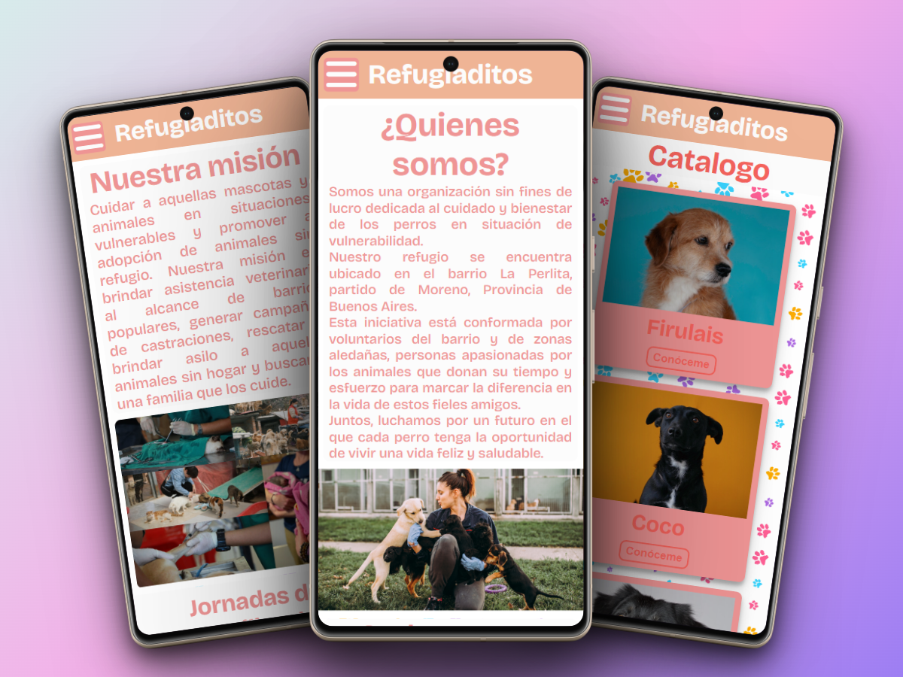

# Proyecto Grupal CoC 4.0 2023
**Comisión**: 23505 - Python FULL STACK.  
**Teacher**: *Alejandro Medici.*

## Team 19
- [***Gramajo Gabriel Omar.***](https://github.com/gabygramajo)
- [***Rodriguez Facundo Nicolas.***](https://github.com/facundo-rod)
- *Diaz Leandro.*
- *Carrillo Alice.*

## Temática
  
Website de **Refugiaditos**, una organización que tiene como misión cuidar a todo tipo de animalito en situación de calle brindando refugio e integrarlos en nuevas familias.

## Stack
- HTML.
- CSS.
- JavaScript.
- Bootstrap.
